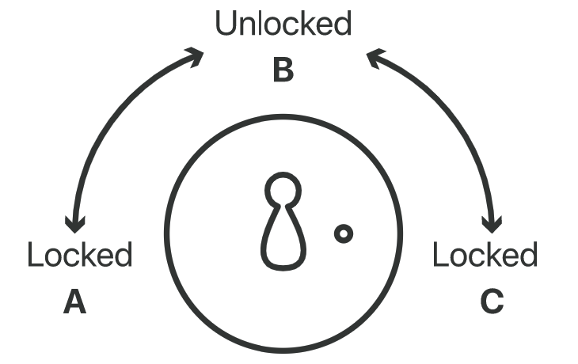

# What is HTTPS?
HTTPS means Hypertext transfer protocol secure. It's secure version of HTTP, which is the primary protocol used to send data between a web browser and a website.
So in 1994, Netscape Communications enhanced HTTP with some encryption. Essentially, they married a new encryption protocol named Secure Socket Layer (SSL) to the original HTTP. This became known as “HTTP over SSL” or “HTTP Secure”. Otherwise known as HTTPS.

Now a days there 50% web application used https over internet.The number are growing radically in the last few years.

# How does HTTPS work?
HTTPS uses an encryption protocol to encrypt the communications. The protocol is called Transport Layer Security (TLS), although formerly it was known as Secure Sockets Layer (SSL).
This protocol secures communications by using an asymmetric public key infrastructure.This type of security system uses two different keys to encrypt communications between two parties i means end to end encrypt.

  1. Private key
  2. Public key

How ever, HTTPS keeps our stuff secret by encrypting it as it moves between our browser and the website’s server. This ensures that anyone listening in on the conversation can’t read anything. This could include our ISP, a hacker, snooping governments, or anyone else who manages to position themselves between me or your and the web server.

Essentially, we need three things to encrypt data:

  1. data we want to encrypt
  2. unique encryption key (just a long string of random text)
  3. an encryption algorithm (a math function that “garbles” the data)

There are 2 common method or algotrithm
  1. asymmetric
  2. symmetric

Symmetric encryption: Symmetric encryption is the simplest and best-known encryption technique.it uses one key for both encryption and decryption.

  1. Because the algorithm behind symmetric encryption is less complex and executes faster, this is the preferred technique when transmitting data in bulk.

  2. The plaintext is encrypted using a key, and the same key is used at the receiving end to decrypt the received ciphertext. The host in the communication process would have received the key through external means.

  3. Widely used symmetric encryption algorithms include AES-128, AES-192, and AES-256.

  

Asymmetric encryption: it's type of encryption is relatively new as compared to symmetric encryption.It's known as key based encryption.On other words, Asymmetric means we’re using two different keys, one to encrypt and one to decrypt.
We also call this Public Key Cryptography because it’s how we establish secure connections on the public internet.

  

# How Public Key Cryptography Works?
Public Key Infrastructure (PKI), both types of encryption are used. Asymmetric (public key) encryption is used first to establish the connection, which is then replaced with symmetric encryption (called the session) for the duration.

Here’s how Public Key Cryptography works in detail:

Public key cryptography can seem complex for the uninitiated; fortunately a writer named Panayotis Vryonis came up with an analogy that roughly goes as follows.

Imagine a trunk with a lock that two people, Bob and Alice, use to ship documents back and forth. A typical lock has only two states: locked and unlocked. Anyone with a copy of the key can unlock the trunk if it's locked, and vice versa. When Bob locks the trunk and sends it to Alice, he knows that Alice can use her copy of the key to unlock the trunk. This is essentially how what's known as symmetric cryptography works: one secret key is used for both encrypting and decrypting, and both sides of a conversation use the same key.

Now imagine, instead, that Bob makes a trunk with a special kind of lock. This lock has three states instead of two:  

  A. Locked, key turned all the way to the left  
  B. Unlocked, in the middle.  
  C. Locked, key turned all the way to the right.  

  

Instead of one key, two keys go with this lock:  

  Key No. 1 can only turn to the left  
  Key No. 2 can only turn to the right  

This means that if the trunk is locked and the key is turned to position A, only key No. 2 can unlock it by turning right, to position B (unlocked). If the trunk is locked in position C, only key No. 1 can unlock it by turning the lock left, to position B.

In other words, either key can lock the trunk – but once it is locked, only the other key can unlock it.

Now let's say Bob makes a few dozen copies of key No. 2, the key that only turns right, and shares them with everyone he knows and anyone who wants a copy, making it his public key. He keeps key No. 1 for himself – it's his private key. What does this accomplish?

  1. Alice can send Bob confidential data via the trunk and be confident that only Bob can unlock it. Once Alice has locked the trunk with the public key, which turns from left to right, only a key that can turn right to left can unlock it. That means only Bob's private key can unlock it.

  2. Alice can be sure that the trunk is actually from Bob, and not an impersonator, if it's locked with his private key. There's only one key that can lock the trunk so that the lock is in position A, or turned all the way to the left: Bob's private key. True, anyone can unlock it with the public key by turning the key to the right, but it's guaranteed that the trunk is from Bob.

Reff: https://www.cloudflare.com/en-gb/learning/ssl/how-does-public-key-encryption-work/  

https://www.hp.com/us-en/shop/tech-takes/what-are-different-types-of-encryption#:~:text=The%20three%20major%20encryption%20types,that%20consumers%20use%20every%20day.  

https://www.cloudflare.com/en-gb/learning/ssl/what-is-encryption/  

https://tiptopsecurity.com/how-does-https-work-rsa-encryption-explained/#!prettyPhoto  

https://www.cloudflare.com/en-gb/learning/ssl/what-is-https/
