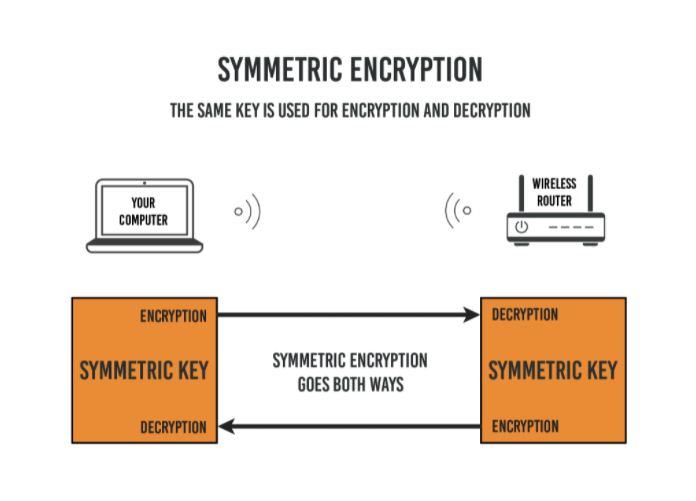
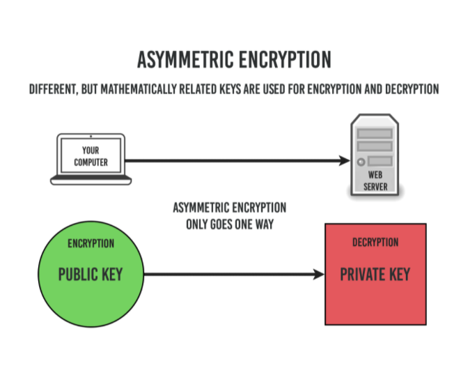
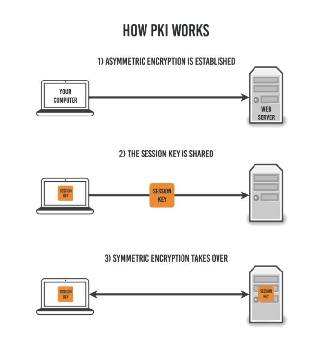

# What is HTTPS?
HTTPS means Hypertext transfer protocol secure. It's secure version of HTTP, which is the primary protocol used to send data between a web browser and a website.
So in 1994, Netscape Communications enhanced HTTP with some encryption. Essentially, they married a new encryption protocol named Secure Socket Layer (SSL) to the original HTTP. This became known as “HTTP over SSL” or “HTTP Secure”. Otherwise known as HTTPS.

Now a days there 50% web application used https over internet.The number are growing radically in the last few years.

# How does HTTPS work?
HTTPS uses an encryption protocol to encrypt the communications. The protocol is called Transport Layer Security (TLS), although formerly it was known as Secure Sockets Layer (SSL).
This protocol secures communications by using an asymmetric public key infrastructure.This type of security system uses two different keys to encrypt communications between two parties i means end to end encrypt.

  1. Private key
  2. Public key

How ever, HTTPS keeps our stuff secret by encrypting it as it moves between our browser and the website’s server. This ensures that anyone listening in on the conversation can’t read anything. This could include our ISP, a hacker, snooping governments, or anyone else who manages to position themselves between me or your and the web server.

Essentially, we need three things to encrypt data:

  1. data we want to encrypt
  2. unique encryption key (just a long string of random text)
  3. an encryption algorithm (a math function that “garbles” the data)

There are 2 common method or algotrithm
  1. asymmetric
  2. symmetric

Symmetric encryption: Symmetric encryption is the simplest and best-known encryption technique.it uses one key for both encryption and decryption.

  1. Because the algorithm behind symmetric encryption is less complex and executes faster, this is the preferred technique when transmitting data in bulk.

  2. The plaintext is encrypted using a key, and the same key is used at the receiving end to decrypt the received ciphertext. The host in the communication process would have received the key through external means.

  3. Widely used symmetric encryption algorithms include AES-128, AES-192, and AES-256.

  

Asymmetric encryption: it's type of encryption is relatively new as compared to symmetric encryption.It's known as key based encryption.On other words, Asymmetric means we’re using two different keys, one to encrypt and one to decrypt.
We also call this Public Key Cryptography because it’s how we establish secure connections on the public internet.

  

# How Public Key Cryptography Works?
Public Key Infrastructure (PKI), both types of encryption are used. Asymmetric (public key) encryption is used first to establish the connection, which is then replaced with symmetric encryption (called the session) for the duration.

  

